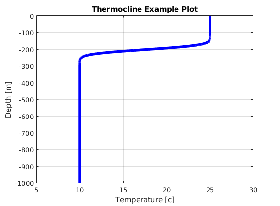

# Thermocline

Generates a temperature gradient that mimics a thermocline.

The function takes four arguments:


- TMIN : minimum temperature
- TMAX : maximum temperature of the gradient
- DEPTH : maximum depth of the output ( +meters )
- CENTER_OF_GRADIENT : center of the transition region ( +meters )


Optional arguments are:  
- THICKNESS : Thickness of the transition region, 0.1 - 0.001, default=0.01. Play with this.
- NPOINTS : Number of points of output desired, default=1000.


The function also outputs two values, which are also plotted for convenience:  
- temp : temperatures (x-axis)
- depth : depth, negative values, from 0 to -DEPTH;

## Usage
To generate a thermocline between 10 and 25 degrees (c), with
the center of the transition at -200m, with approximately a
transition width of 100 meters, a maximum depth of 1000
meters, and using 3000 points, the command would be:

```bash
[temp, depth] = thermocline(10,25,1000,200,0.001,3000)

```

## Contributing

Pull requests are welcome. For major changes, please open an issue first
to discuss what you would like to change.

## License

[MIT](https://choosealicense.com/licenses/mit/)
